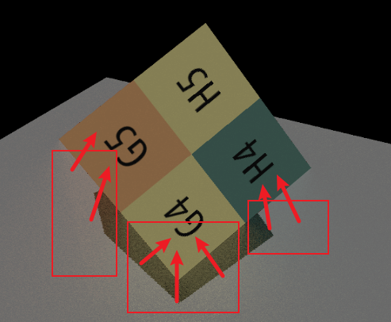

在实现ssr后，只保留间接光照，发现了下面的现象


这个现象显然不对，错误的点可以总结为：

1. 正方体“朝下”的面，也就是不会受到来自上方的直接光照的面，显示在屏幕中时，其附近的floor上的反光消失
2. floor上的反光来源并非来自实际上与其距离最近的面，而是法线朝上的面，这一点从反光的颜色可以看出来，从左到右分别时红、黄、蓝，而离屏幕最近的那个面从左到右也是红、黄、蓝

这个问题不是算法实现的问题，而是“一次弹射间接光” + “ssr”本应产生的结果

ssr是一个屏幕空间的算法，它从着色点打出一条射线，这条射线我们理应在摄像头看过去能看到，而什么时候看不到了，说明其与以摄像头为原点生成的shadow map（或深度图）相交了，认为光线打到了这个平面

这就造成了一个问题，就是ssr打到的平面一定是摄像头能看到的平面，所以上面的2.，反光地面发射的光线被认为打到了面向相机的这个面而非实际应该打到的面，所以反光呈现了面向相机的这个面的颜色。之所以有颜色不是黑色是因为计算间接光源的贡献时**考虑了间接光源的直接光照**，虽然在画面上没有显示出来因为把直接光源贡献的直接光照关了。具体可以看下面这行代码：

```c++
L_ind += EvalDiffuse(dir, wo, screenUV) / pdf * EvalDiffuse(wi, -dir, hitScreenUV) * EvalDirectionalLight(hitScreenUV); // EvalDirectionalLight(hitScreenUV)，间接光源的直接光照，所以间接光源虽然从摄像机看上去是黑的但是在计算过程中被认为是有颜色了，这里只是个提示避免混乱而非主要知识点

```

根据以上分析，1.也很好理解了，因为“朝下”的面露在屏幕中之后，ssr打到的面就变成了这个面，而这个面作为间接光源时，它受不到直接光，也就是它本身就是黑的，与上面说的看起来黑实际上有直接光照的间接光源不同，所以当这个面参与ssr计算时，地面上的反光就是黑的，即没有反光

综上，算法没有写错，这个现象就应该是这样，只能说是应用场景的问题。最后附一张有直接光照的结果图，可以更加清楚地看到上面的2.现象。


